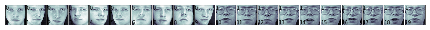
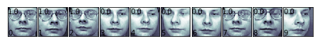

# Chap2 监督学习

## 使用SVM进行图像识别

SVM通过选择分享不同样例的最宽分割超平面来进行分类处理。

通过使用非线性平面，例如 polynomial 或 rbf(radial basis function) 核函数将样本映射到高维特征空间对非线性分布的数据进行分类。

SVM非常适合于高维或稀疏的样本，内存消耗也比较为有效，因为在学习和决定边界时，它只使用样本的子集。

需要注意的是SVM模型训练是计算密集型的。用它进行分类时不会返回数值型的置信度值，虽然我们可以使用交叉验证法避免这个问题，但随之而来的是更高的计算开销。

下面的示例是使用SVM对人脸进行分类处理：


```python
%matplotlib inline 
import sklearn as sk
import numpy as np
import matplotlib.pyplot as plt
from sklearn.datasets import fetch_olivetti_faces

#获取数据集
faces = fetch_olivetti_faces()

print faces.DESCR
```

    Modified Olivetti faces dataset.
    
    The original database was available from
    
        http://www.cl.cam.ac.uk/research/dtg/attarchive/facedatabase.html
    
    The version retrieved here comes in MATLAB format from the personal
    web page of Sam Roweis:
    
        http://www.cs.nyu.edu/~roweis/
    
    There are ten different images of each of 40 distinct subjects. For some
    subjects, the images were taken at different times, varying the lighting,
    facial expressions (open / closed eyes, smiling / not smiling) and facial
    details (glasses / no glasses). All the images were taken against a dark
    homogeneous background with the subjects in an upright, frontal position (with
    tolerance for some side movement).
    
    The original dataset consisted of 92 x 112, while the Roweis version
    consists of 64x64 images.
    


```python
print faces.keys()
```

    ['images', 'data', 'target', 'DESCR']


images是400,64,64的图像，data是400*4096经过归一化处理后的图像数据


```python
def print_faces(images,target,top_n):
    #打印图像
    fig = plt.figure(figsize=(12,12))
    fig.subplots_adjust(left=0,right=1,bottom=0,top=1,hspace=0.05,wspace=0.05)
    for i in range(top_n):
        p = fig.add_subplot(20,20,i+1,xticks=[],yticks=[])
        p.imshow(images[i],cmap=plt.cm.bone)
        
        p.text(0,14,str(target[i]))
        p.text(0,60,str(i))

print_faces(faces.images,faces.target,20);        

```





```python
from sklearn.svm import SVC

#线性核
svc_1 = SVC(kernel='linear')

#分割数据集
from sklearn.cross_validation import train_test_split
X_train,X_test,y_train,y_test = train_test_split(
faces.data,faces.target,test_size=0.25,random_state=0)


from sklearn.cross_validation import cross_val_score,KFold
from scipy.stats import sem

def evalute_cross_validation(clf,X,y,K):
    #创建K拆交叉验证迭代
    cv = KFold(len(y),K,shuffle=True,random_state=0)
    #默认使用评估难器（精度）的分值
    scores = cross_val_score(clf,X,y,cv = cv)
    print scores
    #平均分（精度）,
    print("Mean score: {0: .3f} (+/-{1:.3f})".format(
    np.mean(scores),sem(scores)))
    
evalute_cross_validation(svc_1,X_train,y_train,5)

```

    /Users/zhujie/.pyenv/versions/2.7.14/envs/machinelearn/lib/python2.7/site-packages/sklearn/cross_validation.py:41: DeprecationWarning: This module was deprecated in version 0.18 in favor of the model_selection module into which all the refactored classes and functions are moved. Also note that the interface of the new CV iterators are different from that of this module. This module will be removed in 0.20.
      "This module will be removed in 0.20.", DeprecationWarning)


    [ 0.93333333  0.86666667  0.91666667  0.93333333  0.91666667]
    Mean score:  0.913 (+/-0.012)


使用5折交叉验证的结果是精度0.933，还算不错。


```python
from sklearn import metrics

def train_and_evaluate(clf,X_train,X_test,y_train,y_test):
    clf.fit(X_train,y_train)
    
    print("训练集上的精度:")
    print(clf.score(X_train,y_train))
    print("测试集上的精度")
    print(clf.score(X_test,y_test))
    
    y_pred = clf.predict(X_test)
    
    print("分类器报告：")
    print metrics.classification_report(y_test,y_pred)
    print("混淆矩阵")
    print metrics.confusion_matrix(y_test,y_pred)
    
train_and_evaluate(svc_1, X_train,X_test,y_train,y_test)
#help(cross_val_score)

```

    训练集上的精度:
    1.0
    测试集上的精度
    0.99
    分类器报告：
                 precision    recall  f1-score   support
    
              0       0.86      1.00      0.92         6
              1       1.00      1.00      1.00         4
              2       1.00      1.00      1.00         2
              3       1.00      1.00      1.00         1
              4       1.00      1.00      1.00         1
              5       1.00      1.00      1.00         5
              6       1.00      1.00      1.00         4
              7       1.00      0.67      0.80         3
              9       1.00      1.00      1.00         1
             10       1.00      1.00      1.00         4
             11       1.00      1.00      1.00         1
             12       1.00      1.00      1.00         2
             13       1.00      1.00      1.00         3
             14       1.00      1.00      1.00         5
             15       1.00      1.00      1.00         3
             17       1.00      1.00      1.00         6
             19       1.00      1.00      1.00         4
             20       1.00      1.00      1.00         1
             21       1.00      1.00      1.00         1
             22       1.00      1.00      1.00         2
             23       1.00      1.00      1.00         1
             24       1.00      1.00      1.00         2
             25       1.00      1.00      1.00         2
             26       1.00      1.00      1.00         4
             27       1.00      1.00      1.00         1
             28       1.00      1.00      1.00         2
             29       1.00      1.00      1.00         3
             30       1.00      1.00      1.00         4
             31       1.00      1.00      1.00         3
             32       1.00      1.00      1.00         3
             33       1.00      1.00      1.00         2
             34       1.00      1.00      1.00         3
             35       1.00      1.00      1.00         1
             36       1.00      1.00      1.00         3
             37       1.00      1.00      1.00         3
             38       1.00      1.00      1.00         1
             39       1.00      1.00      1.00         3
    
    avg / total       0.99      0.99      0.99       100
    
    混淆矩阵
    [[6 0 0 ..., 0 0 0]
     [0 4 0 ..., 0 0 0]
     [0 0 2 ..., 0 0 0]
     ..., 
     [0 0 0 ..., 3 0 0]
     [0 0 0 ..., 0 1 0]
     [0 0 0 ..., 0 0 3]]


经过训练后的分类器几乎没有错误。

下面使用分类器分类戴眼镜或不戴眼镜的图像。

下面这些图像是戴眼镜的图像索引范围（如：10-19，30-32这些索引范围的都是戴眼镜的）：


```python
glasses = [
    (10, 19), (30, 32), (37, 38), (50, 59), (63, 64),
      (69, 69), (120, 121), (124, 129), (130, 139), (160, 161),
      (164, 169), (180, 182), (185, 185), (189, 189), (190, 192),
      (194, 194), (196, 199), (260, 269), (270, 279), (300, 309),
      (330, 339), (358, 359), (360, 369)
]
```

创建用于将戴眼镜和不戴眼镜的标识为1和0的目标数据：


```python

def create_target(segments):
    #创建一个新的y数组，大小于target相同，默认值全部为0
    y = np.zeros(faces.target.shape[0])
    #将glasses中指定索引范围的元素设置为1
    for (start,end) in segments:
        y[start:end + 1] = 1
    return y

target_glasses = create_target(glasses)

#分割训练和测试集
X_train,X_test,y_train,y_test = train_test_split(faces.data,
                                                 target_glasses,
                                                 test_size=0.25,
                                                 random_state=0)
svc_2 = SVC(kernel='linear')
evalute_cross_validation(svc_2,X_train,y_train,5)
```

    [ 1.          0.95        0.98333333  0.98333333  0.93333333]
    Mean score:  0.970 (+/-0.012)


```python
train_and_evaluate(svc_2,X_train,X_test,y_train,y_test)
```

    训练集上的精度:
    1.0
    测试集上的精度
    0.99
    分类器报告：
                 precision    recall  f1-score   support
    
            0.0       1.00      0.99      0.99        67
            1.0       0.97      1.00      0.99        33
    
    avg / total       0.99      0.99      0.99       100
    
    混淆矩阵
    [[66  1]
     [ 0 33]]


如何确定这个分类器能用于它未见过的人脸呢？我们可以从样本中分离出10个来（30,39)，用于评估。


```python
X_test = faces.data[30:40]
y_test = target_glasses[30:40]
print y_test.shape[0]

select = np.ones(target_glasses.shape[0])
#选择30:40之外的，值为1的数据
select[30:40] = 0
X_train = faces.data[select == 1]
y_train = target_glasses[select == 1]

print y_train.shape[0]

svc_3 = SVC(kernel='linear')
train_and_evaluate(svc_3,X_train,X_test,y_train,y_test)
```

    10
    390
    训练集上的精度:
    1.0
    测试集上的精度
    0.9
    分类器报告：
                 precision    recall  f1-score   support
    
            0.0       0.83      1.00      0.91         5
            1.0       1.00      0.80      0.89         5
    
    avg / total       0.92      0.90      0.90        10
    
    混淆矩阵
    [[5 0]
     [1 4]]


精度0.9表明存在一个错误的分类。


```python
y_pred = svc_3.predict(X_test)
eval_faces = [np.reshape(a,(64,64)) for a in X_test]
print_faces(eval_faces,y_pred,10)
```





第8个图像识别错了。

## 使用朴素贝叶斯进行文本分类

朴素贝叶斯是从贝叶斯定理中产生的一个简单而强大的概率模型。它通过属于某个分类的实例的每个特征值的概率来决定实例的分类概率。朴素一词指它认为各个特征之间是无关联的。

模型相当于在计算条件概率。

朴素贝叶斯最为成功的应用是在自然语言处理（NLP）领域。NLP问题通常会从文档中抽取大量标签值数据，并以此为基础进行训练。

用来学习的数据集为20个不同主题的19000条新闻，主题包含：政治、宗教、运动、科学。


```python
#%pylab inline
from sklearn.datasets import fetch_20newsgroups

news = fetch_20newsgroups(subset='all')
print type(news.data),type(news.target),type(news.target_names)
print news.data[0]
print news.target[0],news.target_names[news.target[0]]
```

    <type 'list'> <type 'numpy.ndarray'> <type 'list'>
    From: Mamatha Devineni Ratnam <mr47+@andrew.cmu.edu>
    Subject: Pens fans reactions
    Organization: Post Office, Carnegie Mellon, Pittsburgh, PA
    Lines: 12
    NNTP-Posting-Host: po4.andrew.cmu.edu
    
    
    
    I am sure some bashers of Pens fans are pretty confused about the lack
    of any kind of posts about the recent Pens massacre of the Devils. Actually,
    I am  bit puzzled too and a bit relieved. However, I am going to put an end
    to non-PIttsburghers' relief with a bit of praise for the Pens. Man, they
    are killing those Devils worse than I thought. Jagr just showed you why
    he is much better than his regular season stats. He is also a lot
    fo fun to watch in the playoffs. Bowman should let JAgr have a lot of
    fun in the next couple of games since the Pens are going to beat the pulp out of Jersey anyway. I was very disappointed not to see the Islanders lose the final
    regular season game.          PENS RULE!!!
    
    
    10 rec.sport.hockey


###  数据预处理

这里需要将文本转换为数据集。可以使用 sklearn.feature_extraction.text 模块从文本文档中提取特征向量。

在转换前，我们需要先划分训练集和测试集。


```python
SPLIT_PERC = 0.75
split_size = int(len(news.data)*SPLIT_PERC)
X_train = news.data[:split_size]
X_test = news.data[split_size:]
y_train = news.target[:split_size]
y_test = news.target[split_size:]
```

`sklearn.feature_extraction.text` 有三种不同的将文本转换为数值特征的方法：`CountVectorizer`,`HashingVectorizer`,`TfidfVectorizer`。`CountVectorizer` 从文本全集中创建词典，然后将它转化为一个向量，向量中每个元素的值是这个词在某个文档中出现的次数。`HashingVectorizer`不同的是它不在内存中维护字典，而是通过哈希算法将词映射为索引值，然后使用`CountVectorizer`的方式进行计数。`TfidfVectorizier`与`CountVectorizer`也是类似的，但它使用的是更先进的计算方法`TF-IDF`（Term Frequency Inverse Document Frequency），它统计了词在单个文档或所有文档全集中的重要性。比如，它检查词在当前文档中出现有频率与在所有文档集中出现的频率的比值。这种方式能更好的处理归一化的问题，避免样本的词过高的问题。

### 训练贝叶斯分类器
下面将使用`Pipeline`来组合`MultinomiaNB`和三种不同的分词方式进行对比。


```python
from sklearn.naive_bayes import MultinomialNB
from sklearn.pipeline import Pipeline
from sklearn.feature_extraction.text import TfidfVectorizer,HashingVectorizer,CountVectorizer

clf_1 = Pipeline([
    ('vect',CountVectorizer()),
    ('clf',MultinomialNB())
])

clf_2 = Pipeline([
    ('vect',HashingVectorizer(non_negative=True)),
    ('clf',MultinomialNB())
])

clf_3 = Pipeline([
    ('vect',TfidfVectorizer()),
    ('clf',MultinomialNB())
])

from sklearn.cross_validation import cross_val_score,KFold
from scipy.stats import sem

def evaluate_cross_validation(clf,X,y,K):
    #k拆交叉验证
    cv = KFold(len(y),K,shuffle=True,random_state=0)
    scores = cross_val_score(clf,X,y,cv=cv)
    print scores
    print("Mean score: {0:.3f} (+/-{1:.3f})").format(np.mean(scores),sem(scores))

clfs = [clf_1,clf_2,clf_3]
for clf in clfs:
    evaluate_cross_validation(clf,news.data,news.target,5)
```

    [ 0.85782493  0.85725657  0.84664367  0.85911382  0.8458477 ]
    Mean score: 0.853 (+/-0.003)


    /Users/zhujie/.pyenv/versions/2.7.14/envs/machinelearn/lib/python2.7/site-packages/sklearn/feature_extraction/hashing.py:94: DeprecationWarning: the option non_negative=True has been deprecated in 0.19 and will be removed in version 0.21.
      " in version 0.21.", DeprecationWarning)
    /Users/zhujie/.pyenv/versions/2.7.14/envs/machinelearn/lib/python2.7/site-packages/sklearn/feature_extraction/hashing.py:94: DeprecationWarning: the option non_negative=True has been deprecated in 0.19 and will be removed in version 0.21.
      " in version 0.21.", DeprecationWarning)
    /Users/zhujie/.pyenv/versions/2.7.14/envs/machinelearn/lib/python2.7/site-packages/sklearn/feature_extraction/hashing.py:94: DeprecationWarning: the option non_negative=True has been deprecated in 0.19 and will be removed in version 0.21.
      " in version 0.21.", DeprecationWarning)
    /Users/zhujie/.pyenv/versions/2.7.14/envs/machinelearn/lib/python2.7/site-packages/sklearn/feature_extraction/hashing.py:94: DeprecationWarning: the option non_negative=True has been deprecated in 0.19 and will be removed in version 0.21.
      " in version 0.21.", DeprecationWarning)
    /Users/zhujie/.pyenv/versions/2.7.14/envs/machinelearn/lib/python2.7/site-packages/sklearn/feature_extraction/hashing.py:94: DeprecationWarning: the option non_negative=True has been deprecated in 0.19 and will be removed in version 0.21.
      " in version 0.21.", DeprecationWarning)
    /Users/zhujie/.pyenv/versions/2.7.14/envs/machinelearn/lib/python2.7/site-packages/sklearn/feature_extraction/hashing.py:94: DeprecationWarning: the option non_negative=True has been deprecated in 0.19 and will be removed in version 0.21.
      " in version 0.21.", DeprecationWarning)
    /Users/zhujie/.pyenv/versions/2.7.14/envs/machinelearn/lib/python2.7/site-packages/sklearn/feature_extraction/hashing.py:94: DeprecationWarning: the option non_negative=True has been deprecated in 0.19 and will be removed in version 0.21.
      " in version 0.21.", DeprecationWarning)
    /Users/zhujie/.pyenv/versions/2.7.14/envs/machinelearn/lib/python2.7/site-packages/sklearn/feature_extraction/hashing.py:94: DeprecationWarning: the option non_negative=True has been deprecated in 0.19 and will be removed in version 0.21.
      " in version 0.21.", DeprecationWarning)
    /Users/zhujie/.pyenv/versions/2.7.14/envs/machinelearn/lib/python2.7/site-packages/sklearn/feature_extraction/hashing.py:94: DeprecationWarning: the option non_negative=True has been deprecated in 0.19 and will be removed in version 0.21.
      " in version 0.21.", DeprecationWarning)
    /Users/zhujie/.pyenv/versions/2.7.14/envs/machinelearn/lib/python2.7/site-packages/sklearn/feature_extraction/hashing.py:94: DeprecationWarning: the option non_negative=True has been deprecated in 0.19 and will be removed in version 0.21.
      " in version 0.21.", DeprecationWarning)
    /Users/zhujie/.pyenv/versions/2.7.14/envs/machinelearn/lib/python2.7/site-packages/sklearn/feature_extraction/hashing.py:94: DeprecationWarning: the option non_negative=True has been deprecated in 0.19 and will be removed in version 0.21.
      " in version 0.21.", DeprecationWarning)
    /Users/zhujie/.pyenv/versions/2.7.14/envs/machinelearn/lib/python2.7/site-packages/sklearn/feature_extraction/hashing.py:94: DeprecationWarning: the option non_negative=True has been deprecated in 0.19 and will be removed in version 0.21.
      " in version 0.21.", DeprecationWarning)
    /Users/zhujie/.pyenv/versions/2.7.14/envs/machinelearn/lib/python2.7/site-packages/sklearn/feature_extraction/hashing.py:94: DeprecationWarning: the option non_negative=True has been deprecated in 0.19 and will be removed in version 0.21.
      " in version 0.21.", DeprecationWarning)
    /Users/zhujie/.pyenv/versions/2.7.14/envs/machinelearn/lib/python2.7/site-packages/sklearn/feature_extraction/hashing.py:94: DeprecationWarning: the option non_negative=True has been deprecated in 0.19 and will be removed in version 0.21.
      " in version 0.21.", DeprecationWarning)
    /Users/zhujie/.pyenv/versions/2.7.14/envs/machinelearn/lib/python2.7/site-packages/sklearn/feature_extraction/hashing.py:94: DeprecationWarning: the option non_negative=True has been deprecated in 0.19 and will be removed in version 0.21.
      " in version 0.21.", DeprecationWarning)


    [ 0.75543767  0.77659857  0.77049615  0.78508888  0.76200584]
    Mean score: 0.770 (+/-0.005)
    [ 0.84482759  0.85990979  0.84558238  0.85990979  0.84213319]
    Mean score: 0.850 (+/-0.004)


从上面的结果来看CountVectorizer和TfidfVectorizer有相似的性能，它们的效果比HashingVectorizer要好。

下面我们继续使用TfidfVectorizer，并通过调整解析文档所用的正则表达式来提升效果。


```python
clf_4 = Pipeline([
    ('vect',TfidfVectorizer(
    token_pattern = ur"\b[a-z0-9_\-\.]+[a-z][a-z0-9_\-\.]+\b",
    )),
    ('clf',MultinomialNB()),
])

evaluate_cross_validation(clf_4,news.data,news.target,5)
```

    [ 0.86100796  0.8718493   0.86203237  0.87291059  0.8588485 ]
    Mean score: 0.865 (+/-0.003)


默认的正则分词正则表达式为`ur"\b\w\w+\b"`只能匹配字母数字和下划线，调整后的正则表达式能匹配类似 Wi-Fi 和 site.com 这样的词，因此它的精度提升了。

另外我们也可能使用`stop_words`参数：通过它传递一个单词的列表，这个列表中的单词将不会被统计，比如出现太频繁的词，或我们不希望出现的词。


```python
def get_stop_words():
    result = set()
    for line in open('stopwords_en.txt','r').readlines():
        result.add(line.strip())
    return result

clf_5 = Pipeline([
    ('vect',TfidfVectorizer(
        stop_words = get_stop_words(),
        token_pattern = ur"\b[a-z0-9_\-\.]+[a-z][a-z0-9_\-\.]+\b",
    )),
    ('clf',MultinomialNB()),
])

evaluate_cross_validation(clf_5,news.data,news.target,5)
```

    [ 0.86498674  0.87397188  0.86442027  0.87609445  0.86256301]
    Mean score: 0.868 (+/-0.003)


`注意`:此处的stopwords_en.txt中的内容是我手加的，但是仍然可以看到精度有较少的提升。

接下来看`MultinomialNB`的参数。这个分类器有少量参数可以调整；最重要的是`alpha`参数，它是一个平滑度参数，我们可以试试将它从1（默认值），调整为0.01。


```python
clf_7 = Pipeline([
    ('vect',TfidfVectorizer(
        stop_words = get_stop_words(),
        token_pattern = ur"\b[a-z0-9_\-\.]+[a-z][a-z0-9_\-\.]+\b",
    )),
    ('clf',MultinomialNB(alpha=0.01)),
])

evaluate_cross_validation(clf_7,news.data,news.target,5)
```

    [ 0.91962865  0.919342    0.91721942  0.9265057   0.91801539]
    Mean score: 0.920 (+/-0.002)


精度立即有了较大提升。我们可以在此基础上，继续尝试调整分词器的参数和alpha参数。

### 性能评估

当我们已经对模型进行充分提升后，就可以在测试集上评估其性能。

我们将定义一个辅助函数，它将在整个训练集上进行训练，然后在测试集上评估精度。并打印出分类报告（在每个分类上的精度和recall）及对应的混淆矩阵：


```python
from sklearn import metrics

def train_and_evaluate(clf, X_train,X_test,y_train,y_test):
    clf.fit(X_train, y_train)
    
    print("训练集精度：")
    print clf.score(X_train, y_train)
    print("测试集精度：")
    print clf.score(X_test, y_test)
    
    y_pred = clf.predict(X_test)
    
    print("分类器报告：")
    print metrics.classification_report(y_test,y_pred)
    print("混淆矩阵：")
    print metrics.confusion_matrix(y_test,y_pred)
    
train_and_evaluate(clf_7,X_train,X_test,y_train,y_test)
```

    训练集精度：
    0.996816187916
    测试集精度：
    0.91617147708
    分类器报告：
                 precision    recall  f1-score   support
    
              0       0.95      0.88      0.91       216
              1       0.83      0.84      0.84       246
              2       0.91      0.83      0.87       274
              3       0.80      0.86      0.83       235
              4       0.87      0.90      0.89       231
              5       0.89      0.92      0.90       225
              6       0.88      0.80      0.84       248
              7       0.93      0.93      0.93       275
              8       0.96      0.98      0.97       226
              9       0.97      0.94      0.96       250
             10       0.97      1.00      0.98       257
             11       0.96      0.98      0.97       261
             12       0.90      0.91      0.91       216
             13       0.94      0.96      0.95       257
             14       0.94      0.96      0.95       246
             15       0.90      0.97      0.93       234
             16       0.90      0.97      0.94       218
             17       0.97      0.99      0.98       236
             18       0.95      0.90      0.93       213
             19       0.87      0.76      0.81       148
    
    avg / total       0.92      0.92      0.92      4712
    
    混淆矩阵：
    [[190   0   0   0   1   0   0   0   0   1   0   0   0   1   0   9   2   0
        0  12]
     [  0 207   5   4   3  13   4   0   0   0   0   1   3   2   3   0   0   1
        0   0]
     [  0  12 228  23   1   5   1   0   1   0   0   0   0   0   1   0   1   0
        1   0]
     [  0   6   7 201  10   3   4   0   0   0   0   0   3   0   1   0   0   0
        0   0]
     [  0   2   3   5 208   1   4   0   0   0   2   0   5   0   1   0   0   0
        0   0]
     [  0   9   2   1   1 206   0   1   1   0   0   0   0   2   1   0   0   1
        0   0]
     [  0   2   3   9   6   0 198  14   0   2   1   2   6   2   2   0   0   1
        0   0]
     [  0   3   0   1   1   0   7 255   4   1   0   0   0   1   0   0   2   0
        0   0]
     [  0   0   0   0   0   1   1   2 221   0   0   0   0   1   0   0   0   0
        0   0]
     [  0   1   0   0   0   0   1   0   2 236   5   0   1   2   0   1   1   0
        0   0]
     [  0   0   0   1   0   0   0   0   0   0 256   0   0   0   0   0   0   0
        0   0]
     [  0   0   0   0   0   1   0   0   0   0   0 255   0   1   0   0   3   0
        1   0]
     [  0   1   0   2   5   1   3   1   0   2   1   1 196   2   1   0   0   0
        0   0]
     [  0   1   0   1   1   0   0   0   0   0   0   2   1 246   3   0   1   0
        0   1]
     [  0   3   0   0   1   0   1   0   0   0   0   0   0   1 237   0   1   0
        1   1]
     [  1   0   1   2   0   0   0   1   0   0   0   1   1   0   1 226   0   0
        0   0]
     [  0   0   1   0   0   0   1   0   1   0   0   1   0   0   0   0 212   0
        2   0]
     [  0   1   0   0   0   0   0   0   0   0   0   0   0   0   0   0   0 234
        1   0]
     [  1   0   0   0   0   0   1   0   0   0   0   2   1   1   0   1   7   4
      192   3]
     [  9   0   0   0   0   1   0   0   0   1   0   0   0   0   0  14   5   1
        4 113]]


```python
#字典中词的数量
print(len(clf_7.named_steps['vect'].get_feature_names()))
#字典的内容
words = [word for word in clf_7.named_steps['vect'].get_feature_names() if word.startswith('sand')]
print(words)
```

    146044
    [u'sand', u'sandals', u'sandalwood', u'sandbag', u'sandbags', u'sandbanks.cosc.brocku.ca', u'sandberg', u'sandblasting', u'sandcastles', u'sandels', u'sander', u'sanders', u'sanderson', u'sandfort', u'sandhu', u'sandia', u'sandia.llnl.gov', u'sandiego', u'sandiego.ncr.com', u'sanding', u'sandinista', u'sandinistas', u'sandlak', u'sandland', u'sandlot', u'sandman', u'sandman.caltech.edu', u'sandman.cs.hut.fi', u'sandman.ece.clarkson.edu', u'sandoval', u'sandpoint', u'sandra', u'sandra.l.denton', u'sandro', u'sands', u'sandstorm', u'sandstrom', u'sandstrom..22', u'sandvik', u'sandvik-140493185034', u'sandvik-140493185248', u'sandvik-140493230024', u'sandvik-140493233557', u'sandvik-150493144638', u'sandvik-150493181533', u'sandvik-160493205355', u'sandvik-160493205451', u'sandvik-170493104312', u'sandvik-170493104859', u'sandvik-180493131125', u'sandvik-190493200323', u'sandvik-190493200420', u'sandvik-190493200858', u'sandvik-190493201048', u'sandvik-190493224221', u'sandvik-200493000159', u'sandvik-200493232227', u'sandvik-200493233434', u'sandvik-200493235610', u'sandvik-210493014635', u'sandvik-210493213823', u'sandvik-210493225738', u'sandvik-210493230542', u'sandvik-250493163828', u'sandvik-kent.apple.com', u'sandwich', u'sandwiched', u'sandwiches', u'sandy', u'sandy47']


从上面的结果可以看出，字典中包含了类似sandbag，sandbags这样的语义上相近的词。它们应该被分入同一个桶（bucket）中，使用词干技术处理具有同样词根的单词是非常常见的工作。

## 使用决策树解释泰坦尼克假设

一个比较常见的针对线性分类和统计学习方法的争议是很难解释模型是如何确定分类的。如果有一个高维的SVM模型，人们很难想像它的超平面是什么样的。朴素贝叶斯分类器则告诉你：“假如它来自于与训练数据相类似的分布，则这个分类的可能性最大”。

决策树是一种简单而强大的监督学习方法，使用它构造模型可用于预测。

下面的代码主要解决的问题是：根据泰坦尼克乘客的信息，预测他们是否会幸存。数据来自于：http://biostat.mc.vanderbilt.edu/wiki/pub/Main/DataSets/titanic.txt 。每行的数据格式为："1","1st",1,"Allen, Miss Elisabeth Walton",29.0000,"Southampton","StLouis, MO","B-5","24160 L221","2","female"。分别代表序号、仓位等级、是否生存（0为否，1为是）、姓名、年龄、登船港口、家/目的地、房号、票号、船号、性别。首先我们需要使用numpy读取csv文件。


```python
import csv,os
import numpy as np

def load_titanic_data():
    titanic_X, titanic_y,feature_names = [],[],[]
    with open('titanic.csv','rb') as csvfile:
        print(os.path.abspath('titanic.csv'))
        titanic_reader = csv.reader(csvfile,delimiter=',',quotechar='"')
        
        #标题列
        row = titanic_reader.next()
        feature_names = np.array(row)
        
        #数据集和标记
        for row in titanic_reader:
            titanic_X.append(row)
            titanic_y.append(row[2])
        
    return feature_names,np.array(titanic_X),np.array(titanic_y)

feature_names,titanic_X,titanic_y = load_titanic_data()
print(feature_names)
print(titanic_X[0],titanic_y[0])

```

    /Users/zhujie/Documents/devel/python/machine-learn/learning_sklearn/titanic.csv
    ['row.names' 'pclass' 'survived' 'name' 'age' 'embarked' 'home.dest' 'room'
     'ticket' 'boat' 'sex']
    (array(['1', '1st', '1', 'Allen, Miss Elisabeth Walton', '29.0000',
           'Southampton', 'St Louis, MO', 'B-5', '24160 L221', '2', 'female'],
          dtype='|S62'), '1')


### 数据处理
首先我们需要提取用于学习的属性：


```python
#只使用仓位，年龄，性别
titanic_X = titanic_X[:,[1,4,10]]
feature_names = feature_names[[1,4,10]]
print(titanic_X)
print(feature_names)
```

    [['1st' '29.0000' 'female']
     ['1st' ' 2.0000' 'female']
     ['1st' '30.0000' 'male']
     ..., 
     ['3rd' 'NA' 'male']
     ['3rd' 'NA' 'female']
     ['3rd' 'NA' 'male']]
    ['pclass' 'age' 'sex']


特征选择是创建机器学习模型极其重要的一步。无论我们有多好的机器学习算法，如果算法没有获取到好的输入特征，它就得不到足够的学习素材，使用的效果也就会不够好。

有时特征选择有可能会是手工进行的，这取决于我们在这个领域的知识和我们选择的机器学习算法。有时我们也能使用自动化工具来对特征进行评估。在这里我们是手工选择的。某些特征有可能会导致过拟合（如选择姓名后在决策树能直接给出是否幸存）。

查看上面的数据中`NA`值是缺少的年龄值。因此我们需要处理数据集中常见的缺失值的问题。在这里我们使用训练集中的年龄均值来替换缺失值。我们也可以使用不同的方式来处理，比如取训练集中最常见的值或中值。在使用代替值时要非常小心，应该清楚的知道所修改的内容，避免歪曲最终的结果。


```python
ages = titanic_X[:,1]
#年龄均值
mean_age = np.mean(titanic_X[ages != 'NA',1].astype(np.float))
#缺失值处理
titanic_X[titanic_X[:,1]=='NA',1] = mean_age

```

Sklearn中的决策树需要输入是实数特征值，模型的决策规则是下面的形式：
```
Feature <= value
```
比如`age <= 20`。而我们的属性值是分类值，如性别，对应于男/女。因此，我们需要将它们转换为实数值。可以使用sklearn中的`LabelEncoder'类来处理，它的`fit`方法可以将分类值转换至`0..K-1`之间的整数，`K`是数据集中分类的数量。（这里性别值只有0或1）：


```python
#Encode set
from sklearn.preprocessing import LabelEncoder
enc = LabelEncoder()
label_encoder = enc.fit(titanic_X[:,2])
print("Categorical classes:%s" % (label_encoder.classes_))

integer_classes = label_encoder.transform(titanic_X[:,2])
print("Integer classes:%s" % (integer_classes))

t = label_encoder.transform(titanic_X[:,2]) # 将sex属性的值转换为0-1值，并修改至训练集
titanic_X[:,2] = t

print(feature_names)
print(titanic_X[12],titanic_y[12])
```

    Categorical classes:['female' 'male']
    Integer classes:[0 0 1 ..., 1 0 1]
    ['pclass' 'age' 'sex']
    (array(['1st', '31.1941810427', '0'],
          dtype='|S62'), '1')


另一个分类属性是：class。可以使用相似的方式转换为0，1，2。这个转换会隐式的对分类增加排序，在这里不会产生问题。但是面对更好的方式是不产生这个顺序，且能将广泛的分类转换为实数值。这里可以使用另一个编码器将这class属性转换为3个新的特征，每个特征都用0,1值表示。这种编码方式被称为`one hot`编码，它是一种将分类属性转换为实数值的常用方法。


```python
from sklearn.preprocessing import OneHotEncoder

enc = LabelEncoder()
label_encoder = enc.fit(titanic_X[:,0])
print("仓位分类：%s" %(label_encoder.classes_))

integer_classes = label_encoder.transform(label_encoder.classes_).reshape(3,1)

print("整数分类值：%s" %(integer_classes))

enc = OneHotEncoder()

one_hot_encoder = enc.fit(integer_classes)
num_of_rows = titanic_X.shape[0]

# 第一步：使用label_encoder将仓位(class)属性转换为0-(N-1)的整数值
t = label_encoder.transform(titanic_X[:,0]).reshape(num_of_rows,1)

# 第二步：创建一个三列的稀疏矩阵，它的每列表示一个分类，用于标识class属性是否属于该分类
new_features = one_hot_encoder.transform(t)

# 将新特征添加至titanix_X
titanic_X = np.concatenate([titanic_X,new_features.toarray()],axis=1)

# 移除转换过的列
titanic_X = np.delete(titanic_X,[0],1)

# 更新特征名称
feature_names = ['age','sex','first_class','second_class','third_class']

# 转换为数值
titanic_X = titanic_X.astype(float)
titanic_y = titanic_y.astype(float)

print(feature_names)
print("%s %s" % (titanic_X[0],titanic_y[0]))
```

    仓位分类：['1st' '2nd' '3rd']
    整数分类值：[[0]
     [1]
     [2]]
    ['age', 'sex', 'first_class', 'second_class', 'third_class']
    [ 29.   0.   1.   0.   0.] 1.0


现在数据集已经可以用来训练决策树了。并且，归一化对决策树来说不是问题，因为特征的相对大小对于分类没有影响。

预处理步骤在机器学习方法中经常被低估了，但是我们应该看到即使是在这个非常简单的例子中，仍然需要花些时间来让数据满足训练方法的要求。它在机器学习过程中是非常重要的，无论我们选择多好的学习方法，如果这一步失败，后续步骤一样会失败。

### 训练决策树分类器


```python
from sklearn.cross_validation import train_test_split

X_train,X_test,y_train,y_test = train_test_split(titanic_X,titanic_y,test_size=0.25,random_state=33)

from sklearn import tree

clf = tree.DecisionTreeClassifier(criterion='entropy',max_depth=3,min_samples_leaf=5)
clf = clf.fit(X_train,y_train)

```

`DecisionTreeClassifier`可接收多个超参数。这里使用信息增益（Information Gain)来判断训练数据的分割，并告诉分类器最多构建3层，且每个叶节点至少包含5个训练实例。为了解释决策树，我们可以将构建的模型可视化。


```python
import pydot,StringIO
dot_data = StringIO.StringIO()

tree.export_graphviz(clf,out_file=dot_data,feature_names=['age','sex','1s_class','2nd_class','3rd_class'])

(graph,) = pydot.graph_from_dot_data(dot_data.getvalue())
graph.write_png('titanic.png')
from IPython.core.display import Image, display
display(Image(filename='titanic.png'))
```


对样例分类时，我们需要回答每个节点上的问题。比如，对于根节点，问题是：`sex<-0.5`（是否为女性）。如果答案为是，则走向左边的子树，否则走向右边的子树。继续回答下去直到达到叶节点。这时，样例被归类为实例最多（针对前一节点的问题）的这一类。

如何确定在每个节点上应该询问什么问题呢？答案是“信息增益”（或使用sklearn中使用的另一个度量方式“基尼系数”）。信息增益用于度量我们回答问题后损失了多少熵。`熵`用于度量集合的混合程度，如果熵为0，则将意味着所有值是相同的（在我们的示例中，同一目标分类下的值是相同的）。当两个分类的样本数量相同时熵达到最大值（比如一半样例为幸存，另一半死亡）。

### 解释决策树
在树的开始位置共有984个实例，662个死亡，332个幸存。初始熵为0.912。从可能的问题列表中挑选出产生最大熵的问题是：他是否为女性？如果答案为是，熵几乎是相同的，如果为否则它的值变化较大（男性伤亡的比例更高）。

每个节点上都有：问题、香农熵、样本数量和分布。  每一步样本数量都会根据问题的答案分配到左边或右边。直至遇到结束条件（在这里是直到第四层，或样本的数量少于5个）。

在使用模型进行判断时，我们拿样本来遍历树节点，并回答各个节点的问题，直到到达叶节点。这时，我们检查训练集上每个分类的样本数量，并选择样本数量较多的分类作为要判断的样本的分类。

例如，判断一个头等仓的10岁女孩是否能幸存。首先，回答第一个问题（是否为女性？）答案为是，因此进入左树。接下来回答为否（是否为3等仓），是（是否为头等仓）。这时到达了叶节点，在训练时这个节点有102个样本，其中97个幸存，因此最终的答案是幸存。（译注：书中的树结构与上面生成的结构不同）


我们也能感觉到答案的合理性：伤亡者多数是二等或三等仓中的男性（从树中样本可以看到）。多数头等仓中的女孩都幸存了。我们可以检测下模型在训练集上的精度：


```python
from sklearn import metrics
def measure_performance(X,y,clf, show_accurary=True, show_classification_report=True, show_confussion_matrix=True):
    y_pred = clf.predict(X)
    if show_accurary:
        print("精度：{0:.3f}".format(metrics.accuracy_score(y,y_pred)))
    if show_classification_report:
        print("分类器报告：")
        print("%s" % metrics.classification_report(y,y_pred))
    if show_confussion_matrix:
        print("混淆矩阵")
        print(metrics.confusion_matrix(y,y_pred))

measure_performance(X_train,y_train,clf,show_classification_report=False,show_confussion_matrix=False)

```

    精度：0.838


我们的决策树在训练集上的精度为0.838。但这并不是个好的指标，特别是对于决策树容易出现过拟合。因为我们并没有划分验证集，且应该使用交叉验证。比如，使用交叉验证的一种特例，留一法（leave-one-out cross-validation）。对于训练集中的每个样本，我们用其余样本训练模型，并用这个保留样本评估模型。在执行与训练样本数量一样多的分类之后，我们根据预测保留样本类别的次数的比例来计算准确度，会发现它比之前的方式的值要低（这是适合预期的，因为之前的方式容易过拟合，它是在训练集上进行验证的）。

译注 ：
留一法交叉验证：假设有N个样本，将每一个样本作为测试样本，其它N-1个样本作为训练样本。这样得到N个分类器，N个测试结果。用这N个结果的平均值来衡量模型的性能。

普通交叉验证：我理解的是K倍交叉验证（k-fold cross validation）：将所有样本分成K份，一般每份样本的数量相等或相差不多。取一份作为测试样本，剩余K-1份作为训练样本。这个过程重复K次，最后的平均测试结果可以衡量模型的性能。

https://www.zhihu.com/question/23561944


```python
from sklearn.cross_validation import cross_val_score, LeaveOneOut 
from scipy.stats import sem

def loo_cv(X_train, y_train,clf):
    loo = LeaveOneOut(X_train[:].shape[0])
    scores = np.zeros(X_train[:].shape[0])
    for train_index,test_index in loo:
        X_train_cv,X_test_cv = X_train[train_index],X_train[test_index]
        y_train_cv,y_test_cv = y_train[train_index],y_train[test_index]
        clf = clf.fit(X_train_cv,y_train_cv)
        y_pred = clf.predict(X_test_cv)
        scores[test_index] = metrics.accuracy_score(y_test_cv.astype(int),y_pred.astype(int))
    print("Mean score: {0:.3f} (+/-{1:.3f})".format(np.mean(scores),sem(scores)))

loo_cv(X_train,y_train,clf)
```

    Mean score: 0.837 (+/-0.012)


使用留一交叉难法的好处是它能让绝大部分数据用于训练，因此特别适合于样本数据比较少的情况。它的主要问题是需要针对每个样本训练一个分类器会需要大量的计算。


### 随机森林——随机化决策

决策树存在一个问题，在回答问题之后训练集会被拆分，就不会再参与到后续的决策。比如，当数据集按性别拆分后，后面的问题将只与男性或女性相关，而无法处理与性别无关的问题（如，年龄小于一岁的与性别无关）。随机森林试图在每步中引入一定的随机化，用替代树组合以获取最终的预测值。这类考虑多个分类器回答相同问题的方式被称为集成方法（ensemble methods）。在上面预测幸存的任务中，难以使用这种算法，因为它的特征太少了。

随机森林随机选择训练集的一个子集来训练决策树，且只使用随机选择的部分特征。经过多次训练后树数量增加，产生了一套分类器。在进行预测时，每棵树都对样本进行预测，最终的结果则由组合分类器根据所有树的预测结果投票决定。


```python
from sklearn.ensemble import RandomForestClassifier
clf = RandomForestClassifier(n_estimators = 10, random_state=33)
clf = clf.fit(X_train,y_train)
loo_cv(X_train,y_train,clf)
```

    Mean score: 0.817 (+/-0.012)


引入随机会后，看起来效果变差了，因为特征的数量太少。当处理的数据特征和样本数量都比较多时，随机森林可以在保留决策树优点的情况下，以非常快速、简单的方式来提升精度。并且，在下节我们将使用它来进行拟合。

### 性能评估
每种监督学习任务的最后一步都是在未使用过的数据集上对分类器进行评估，以确定它的预测能力。这一步不应该使用已经。


```python
clf_dt = tree.DecisionTreeClassifier(criterion='entropy',max_depth=3,min_samples_leaf=5)
clf_dt.fit(X_train,y_train)
measure_performance(X_test,y_test,clf_dt)
```

    精度：0.793
    分类器报告：
                 precision    recall  f1-score   support
    
            0.0       0.77      0.96      0.85       202
            1.0       0.88      0.54      0.67       127
    
    avg / total       0.81      0.79      0.78       329
    
    混淆矩阵
    [[193   9]
     [ 59  68]]


## 使用拟合进行房价预测
将拟合看作可以无限分类的分类。

本节将对同一数据集使用多种拟合方法。通过使用样本的属性预测出它的价格。数据集包含506个样本，每个样本14个特征，特征的值都是实数值。

sklearn中包含了这些样本数据。


```python
import numpy as np
import matplotlib.pyplot as plt
from sklearn.datasets import load_boston

boston = load_boston()
print(boston.data.shape)
print(boston.feature_names)
print("最高价：%s 最低价：%s 平均价：%s"%(np.max(boston.target),np.min(boston.target),np.mean(boston.target)))
#print(boston.DESCR)
```

    (506, 13)
    ['CRIM' 'ZN' 'INDUS' 'CHAS' 'NOX' 'RM' 'AGE' 'DIS' 'RAD' 'TAX' 'PTRATIO'
     'B' 'LSTAT']
    最高价：50.0 最低价：5.0 平均价：22.5328063241


查看`boston.DESCR`来了解数据集各个特征。这是需要重要的，我们需要通过理解数据来选择合适的模型。

分割数据集，并进行归一化：


```python
from sklearn.cross_validation import train_test_split
X_train,X_test,y_train,y_test = train_test_split(boston.data,boston.target,test_size=0.25,random_state=33)
#y_train = [y_train]
#y_test = [y_test]
from sklearn.preprocessing import StandardScaler
scalerX = StandardScaler().fit(X_train)
scalery = StandardScaler().fit(y_train.reshape(-1,1))
X_train = scalerX.transform(X_train)
y_train = scalery.transform(y_train.reshape(-1,1))
X_test = scalerX.transform(X_test)
y_test = scalery.transform(y_test.reshape(-1,1))

```

如何对预测的结果进行评估呢？之前我们用过交叉验证，但是精度值并不适合，因为这里我们预测的值是实数值。sklearn针对这种情况提供了多种度量方式，最常用的`R2`值，或决定系数（coef cient of determination）度量模型所解释的结果的变化比例，这是sklearn中拟合方法默认使用的评估方法。当分值达到最大值1时，模型的与目标值最为匹配。通过这种方式，我们定义一个方法训练模型，并采用五折交叉验证和决定系数（coef）来评估其性能。


```python
from sklearn.cross_validation import *
def train_and_evaluate(clf,X_train,y_train):
    clf.fit(X_train,y_train)
    print("训练集上的决定系数：%s" % (clf.score(X_train,y_train)))
    #五折交叉验证
    cv = KFold(X_train.shape[0],5,shuffle=True,random_state=33)
    scores = cross_val_score(clf,X_train,y_train,cv=cv)
    print("使用五折交叉验证的平均决定系数：%s"%(np.mean(scores)))
```

### 第一次尝试 线性模型
线性模型试图回答的问题是在由学习特征（包括目标值）组成的14维空间中哪个超平面与它们更接近。当找到这个超平面后，通过将要预测的点投影到超平面，并返回这个点在目标轴（目标值所在维）上坐标值来实现预测。

但是什么是接近呢？通常使用最小二乘：计算每个样本距离超平面的距离，并平方（避免正符符号问题），并求和。超平面就是最小二乘评估器的较小值。

下面使用SGDRegressor这一线性模型，它通过最小化平方误差来实现。


```python
from sklearn import linear_model
clf_sgd = linear_model.SGDRegressor(loss='squared_loss',penalty=None,random_state=42)
train_and_evaluate(clf_sgd,X_train,y_train)
print("超平面：%s" % (clf_sgd.coef_))
```

    训练集上的决定系数：0.743617732983
    使用五折交叉验证的平均决定系数：0.710809853468
    超平面：[-0.08527595  0.06706144 -0.05032898  0.10874804 -0.07755151  0.38961893
     -0.02485839 -0.20990016  0.08491659 -0.05495108 -0.19854006  0.06126093
     -0.37817963]


参数 penalty 参数是线性拟合方法中为避免过拟合而引入的惩罚因子。它通过检查超平面每个特征对预测值的贡献，惩罚那些超平面系数太大的情况。这个参数通常使用 `L2`（系数的平方和） 正则或 `L1`（系数的绝对值之和）正则。下面是使用L2正则。


```python
clf_sgd1 = linear_model.SGDRegressor(loss='squared_loss',penalty='l2',random_state=42)
train_and_evaluate(clf_sgd1,X_train,y_train)

```

    训练集上的决定系数：0.743616743208
    使用五折交叉验证的平均决定系数：0.71081206667


这种情况下，并未得到提升。

### 第二次尝试 支持向量机
使用SVM可以代替超平面进行拟合。


```python
from sklearn import svm
clf_svr = svm.SVR(kernel='linear')
train_and_evaluate(clf_svr,X_train,y_train)

```

    训练集上的决定系数：0.71886923342
    使用五折交叉验证的平均决定系数：0.707838419194


仍然没的提升。但SVM的一个好处就在于我们可以使用非线性函数（核函数），比如，使用多项式函数逼近（polynomial核）。


```python
clf_svr_ploy = svm.SVR(kernel = 'poly')
train_and_evaluate(clf_svr_ploy,X_train,y_train)
```

    训练集上的决定系数：0.904109273301
    使用五折交叉验证的平均决定系数：0.779288545488


现在有了提升。实际上还可以使用RBF核来提升。


```python
clf_svr_rbf = svm.SVR(kernel='rbf')
train_and_evaluate(clf_svr_rbf,X_train,y_train)
```

    训练集上的决定系数：0.900132065979
    使用五折交叉验证的平均决定系数：0.833662221567


RBF核是sklearn中SVM的默认核函数。

### 第三次尝试 重访随机森林

我们可以使用随机森林来实现拟合。之前我们使用过随机森林进行分类。在用作拟合时，树的构建过程与之前类似，但是在预测时，当我们到达叶节点时，我们不返回主分类，而是返回一个实数值，比如，叶节点下样本的均值。

实际上我们将使用“Extra Tree”，它由模块`sklearn.ensemble`模块中的`ExtraTreesRegressor`类提供。它增加了额外的随机化处理。它不仅在每棵树的样本、选择特征时使用了随机值，在每个决策位置也引入了随机的阀值。


```python
from sklearn import ensemble
clf_et = ensemble.ExtraTreesRegressor(n_estimators=10,random_state=42) # ,compute_importances=True不再被支持
train_and_evaluate(clf_et,X_train,y_train)
```

    /Users/zhujie/.pyenv/versions/2.7.14/envs/machinelearn/lib/python2.7/site-packages/ipykernel_launcher.py:3: DataConversionWarning: A column-vector y was passed when a 1d array was expected. Please change the shape of y to (n_samples,), for example using ravel().
      This is separate from the ipykernel package so we can avoid doing imports until


    训练集上的决定系数：1.0
    使用五折交叉验证的平均决定系数：0.861758978344


首先我们注意到不光消除了欠拟合（在训练集上完全匹配），而提高了在交叉验证上的性能。Extra Tree的一个有意思的功能是，它允许计算在拟合任务中每个特征的重要性。


```python
print(np.sort(zip(clf_et.feature_importances_,boston.feature_names),axis=0))
```

    [['0.00504385320276' 'AGE']
     ['0.0151425137151' 'B']
     ['0.0170525784005' 'CHAS']
     ['0.0189418210858' 'CRIM']
     ['0.0236025617776' 'DIS']
     ['0.0257330490046' 'INDUS']
     ['0.0318741622351' 'LSTAT']
     ['0.0344056449393' 'NOX']
     ['0.0397131333452' 'PTRATIO']
     ['0.0466185213973' 'RAD']
     ['0.0995118014928' 'RM']
     ['0.284215227964' 'TAX']
     ['0.35814513144' 'ZN']]


我们可以看到ZN属性（面积）和TAX属性（含税价）是影响最终决策的最有影响力的特征。

### 评估
我们使用修改版的函数（这个函数会显示决策时的参数）来进行评估。


```python
from sklearn import metrics
def measure_performance(X,y,clf,show_accuracy=True,
show_classification_report=True,show_confussion_matrix=True,
show_r2_score=False):
    y_pred = clf.predict(X)
    if show_accuracy:
        print("精度：{0:.3f}".format(metrics.accurary_score(y,y_pred)))
    if show_classification_report:
        print("分类器报告：")
        print(metrics.classification_report(y,y_pred))
    if show_confussion_matrix:
        print("混淆矩阵")
        print(metrics.confusion_matrix(y,ypred))
    if show_r2_score:
        print("决策参数：{0:.3f}".format(metrics.r2_score(y,y_pred)))

measure_performance(X_test,y_test,clf_et,show_accuracy=False,show_classification_report=False,
show_confussion_matrix=False,show_r2_score=True)
```

    决策参数：0.802


### 小结
本章介绍了监督学习的常用方法。监督学习需要样本具备输入特征和目标值。下章接触到的非监督学习则不需要目标值。这些方法对于弄清数据的结构非常有用，且可以作为训练监督学习模型的前凑步骤。
