# 非监督学习
从前一章我们可以看到即监督学习方法可以在已有数据基础上判断将来的数据，但也存在明显的缺点：数据必须是准备过的；必须人工对一定的样本进行标记。这项工作通常需要由专家来完成（比如，为了正确的分类莺尾花，需要一些了解这些花的人），这将需要耗费一些时间和金钱，并且不会产生大量的数据（至少不能与Internet上的数据相比！）。每个监督学习方法都需要构建在尽可能多的样本数据上。

但是某些情况下我们可能没有标记过的数据。比如在婚礼上安排座位，你想将某类人分在同一桌（新娘的家人，新郎的朋友等），这个任务在机器学习中被称为“聚类”（Clustering）。有些人可能属于多个分组，你需要决定不那么相似的人是否能放在一起（比如新娘和新郎的父母）。聚类需要找出所有元素中相类似的一组元素，但是不同分组中的元素是不同的。如何定义相似是聚类方法需要回答的问题。另一个重要的问题是如何分割簇。人类非常善于从二维数据中找出聚簇（比如从地图中根据出现的街道标识出城市），但是当维度增加时情况会更复杂。

本章将聚焦于多个聚类方法：k-means、affinity propagation、mean shift、Gaussian Mixture Models。

非监督学习的另一个方面是降维（Dimentionality Reduction）。假如我们需要展现学习样本的大量属性并将它们的主要特性展示出来。当特征数量超过3时就非常困难了，因为我们不能展示3维以上的模型。降维提供了一种手段，让我们可以将高维数据在低维空间中展现出来，并保留（至少是部分的保留）它们的模式结构。这些方法也有助于我们进行模型的选择。比如，是否应该在某些监督学习任务中使用线性超平面或其它更复杂的模型。

## 主成份分析（PCA)
PCA是一种正交线性转换算法，它将一组相关的变量集转换为一组不相关的变量集。新的变量位于新的坐标系中，通过将数据投影到第一个坐标轴得到最大的变化，投影到第二个坐标轴得到第二大的变化，依次类推。这些新的坐标轴被称为主成分，我们可以有与原始数据维数相同多的主成人，但是我们只保留那些有高方差的。每个新的主成人被添加到主成份集中，但它必须遵守应该与其它主成份正交性（不相关）的限定。PCA可以被看作是一种揭示数据内部结构的一种方法；它提供了原始数据在低维空间上的投影。如果我们只保留第一个主成分，数据维度被重建我们可以比较方便的将数据的结构展示出来。如果包含前两个主成分，则可以在二维图上展示。PCA可以方便我们在构建预测模型前观察和分析数据。


对于机器学习方法而言，PCA可以在尽可能保留高方差的情况下将高维空间在低维重建。它是一个非监督方法，因为它在转换时不需要目目标值；它只依赖于学习的样本属性值。这对于以下两个目标非常有用：

 - 可视化：高维数据映射到二维图。

 - 特征选择：将高维样本映射到低维，可以避免维数灾难。将样本使用PCA转换至低维，在这个新的空间中使用机器学习算法。

 本节以手写识别样本数据为例，样本为 8x8 像素的图像，即每个样本有64个属性。64维的数据不能可视化，因此可以使用PCA将它转换为2维进行可视化处理。


```python
from sklearn.datasets import load_digits

digits = load_digits()

X_digits ,y_digits = digits.data,digits.target
print(digits.keys())
```

    ['images', 'data', 'target_names', 'DESCR', 'target']


```python
import matplotlib.pyplot as plt
n_row,n_col = 2, 5

def print_digits(images,y,max_n=10):
    #设置figure大小
    fig = plt.figure(figsize=(2. * n_col,2.26 * n_row))
    i = 0
    while i< max_n and i < images.shape[0]:
        p = fig.add_subplot(n_row,n_col,i+1,xticks=[],yticks=[])
        
        p.imshow(images[i],cmap=plt.cm.bone,
                 interpolation='nearest')
        
        p.text(0,-1,str(y[i]))
        i = i+1
    plt.show()

print_digits(digits.images,digits.target,max_n=10)
```


定义一个函数绘制PCA转换后的二维散点图。数据点将会被根据它的分类加上颜色。样本中的目标值，不会参与转换；但我们需要了解进行PCA转换后了解他们的分布情况。我们使用10种不同的颜色来表示这10个数字。


```python
def plot_pca_scatter(X_pca):
    colors = ['black','blue','purple','yellow','white','red','lime','cyan','orange','gray']
    for i in xrange(len(colors)):
        px = X_pca[:,0][y_digits == i]
        py = X_pca[:,1][y_digits == i]
        plt.scatter(px,py,c=colors[i])
    plt.legend(digits.target_names)
    plt.xlabel('First Principal Component')
    plt.ylabel('Second Principal Component')
    plt.show()
    
```

接下来我们需要进行PCA转换。在sklearn中，PCA被实现为通过`fit`方法学习一定数量样本后产生的转换对象。有好几种类型的实现不同类型PCA分解器，比如PCA、ProbalilisticPCA、RandomizePCA、KernelPCA。这里，我们使用 sklearn.decomposition 模块中的 PCA 类。最重要的参数是 n_components，通过它可以指定所获得的对象应有的特征数量。这里，我们需要将64个特征转换为2个特征，因此 n_components 需要设置为 2。


```python
from sklearn.decomposition import PCA
estimator = PCA(n_components = 10)
X_pca = estimator.fit_transform(X_digits)
plot_pca_scatter(X_pca)
```


译注：得到的图是书中图的垂直翻转镜像，也许是因为PCA类的实现有变化！

从上图，我们可以得到以下结论：

 - 可以看到对应于10个数字的10个不同的分类。其中的多数分类的聚簇是比较清晰的，它们的簇间有一定的距离。除了数字5对应的样本分布比较稀疏，与其它分类存在重叠。

 - 另一个极端是数字0对应的分类，它的聚簇是最为独立的。凭直觉可以认为这类样本应该是最容易与其它类型区分开的；如果我们训练分类器，则它的分类结果应该是最好的。

 - 从局部分布来看，我们可以预测邻近的分类对应于相类似的数字，它们比较难于区分。比如，数字9和3的簇是相邻的，可能从3中分离出9会比从4中分离出9更困难。

 我们迅速的从图中获取到了一些信息。这种方式可以用在训练监督模的分类器前，用于更理解所面临的困难。使用这些知识，我们可以更好的对特征进行预处理，进行特征选择，选择一个更合适的学习模型。如前面提到的，这也可以帮助我们进行维度的重建，避免陷入维度灾难，也可以使我们使用更简单的方法，比如线性模型来处理这些问题。

 通过访问评估器的 `components_` 属性，我们可以了解主成分转换器。每个主成分都是一个矩阵，用于将原始空间中的向量转换至目标空间。而在上面的散点图中，我们只能看到两个成分。

 我们可以按原始数据同样的形状（shape），绘制出所有的成分。(译注：这里是以图像形式绘制各个主成分转换矩阵，与原始的图像没有直接关系)


```python
def print_pca_components(images,n_col,n_row):
    plt.figure(figsize=(2. * n_col,2.26 * n_row))
    for i,comp in enumerate(images):
        plt.subplot(n_row,n_col,i+1)
        plt.imshow(comp.reshape((8,8)),
                   interpolation='nearest')
        plt.text(0,-1,str(i+1)+'-componet')
        plt.xticks(())
        plt.yticks(())
    plt.show()

print_pca_components(estimator.components_,5,2)
```


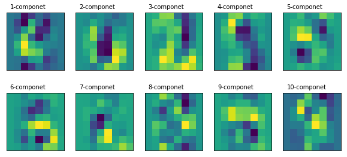


译注：得到的图与书中也是相反的，这可能是导致上面的散点图像与书中相比是垂直翻转镜像的原因。书中深浅区域与上图中的刚好相反，上图中深蓝区域，在书中是深红色。会导致下面的部分描述也需要相反的方式描述。

通过查看头两个成分的图，我们可以发现一些有趣的信息：

 - 从第二个主成分图中，我们可以看出图像的中心区域是最暗的。数字图像中与之最类似的是0，因为它的中心区域是空的。通过查看前面的散点图可以确认这个直觉。查看数字0对应的簇可以看到它对应于第二个主成分的值是比较高的。

 - 从第一个成分图中可以看到，如散点图中看到的，它对于分割数字4（左边值高）和3（右边值低）对应的簇是非常有效的。这个区域中的低地（蓝色）区域与数字3非常像，但它的高亮部分（黄色）与数字4非常像。

 如果我们使用额外的主成分，我们将获取更多和特征以便将样本分到新的维度。比如，我们可以添加第三个主成分描绘出3维散点图。

 ## 使用k-means进行手写识别
 K-means是最流行的聚类算法，因为它简单，易于实现且在不同任务中都有较好的性能表现。它属于分区聚类算法，这类算法同时将分区数据放入不同的被称为簇的分组中。另一类，本书不会涉及的是层次聚类算法，这类算法先找到初始的簇，之后将它分离或者合并到新的簇。

 K-means算法的主要思想是找到数据的分区，比如让簇均值（中心）与每个点的距离平方值最小化。需要注意的是，这类算法假设定你知道你的数据应该被划分的簇的数量（分类的数量）。

 用k-means实现手写识别：


```python
from sklearn.preprocessing import scale
digits = load_digits()
data = scale(digits.data)

def print_digits(images,y,max_n=10):
    fig = plt.figure(figsize=(12,12))
    fig.subplots_adjust(left=0,right=1,bottom=0,top=1,hspace=0.05,wspace=0.05)
    i = 0
    while i< max_n and i < images.shape[0]:
        p = fig.add_subplot(20,20,i+1,xticks=[],yticks=[])
        p.imshow(images[i],cmap=plt.cm.bone)
        p.text(0,14,str(y[i]))
        i = i + 1
    plt.show()

print_digits(digits.images,digits.target,max_n=10)


```


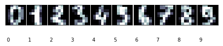


```python
import numpy as np
from sklearn.cross_validation import train_test_split
X_train,X_test,y_train,y_test,images_train,images_test = train_test_split(
    data,digits.target,digits.images,test_size=0.25,
    random_state=42)

n_samples,n_features = X_train.shape
n_digits = len(np.unique(y_train))
labels = y_train

```

训练数据准备好后，接下来就是将样本进行分簇。K-means是按下面的步骤处理的：

 1. 随机选择初始的簇中心

 2. 找到离每个样本最近的簇中心，并将样本归于这个簇

 3. 计算簇数据点的均值作为新的簇中心。重复进行这个处理直到簇的成员稳定；即每次迭代时只有少量样本的簇标签发生变化

 由k-means的工作方式可知，它有可能陷入局部极小值，且簇中心的初始值对分类的影响非常大。减轻这一问题最常用的方式是尝试多次，选择样本至簇心（或惯性中心）距离平方和最小的一组。sklearn中的k-means实现已经包含了这个功能（n-init参数可以设置尝试的次数）。它也允许我们指定分割数据的初始重心，以便获取更好的结果。


```python
from sklearn import cluster

clf = cluster.KMeans(init='k-means++', n_clusters=10,random_state=42)
clf.fit(X_train)
```


    KMeans(algorithm='auto', copy_x=True, init='k-means++', max_iter=300,
        n_clusters=10, n_init=10, n_jobs=1, precompute_distances='auto',
        random_state=42, tol=0.0001, verbose=0)


这个过程与之前的监督学习类似，但是fit方法只需要接收训练数据，而没有分类标签。并且在调用时需要指定簇的数量。这里我们知道这个值。

如果我们打印出分类器的`labels_`属性，将得到每个簇心与各个样本间的距离的list。


```python
print_digits(images_train,clf.labels_,max_n=10)
```


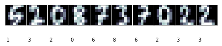


这里的簇编号与实际的数值并没有关系。因为我们并不是使用分类；而只是按图像的相似性进行分组。

然后我们可以使用`predict`方法对训练集进行分类。


```python
y_pred = clf.predict(X_test)

def print_cluster(images,y_pred,cluster_number):
    images = images[y_pred==cluster_number]
    y_pred = y_pred[y_pred==cluster_number]
    print_digits(images,y_pred,max_n=10)


for i in range(10):
    print_cluster(images_test,y_pred,i)

```


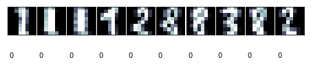


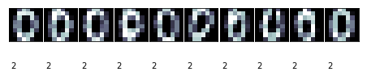


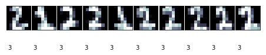


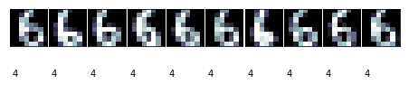


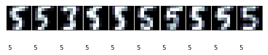


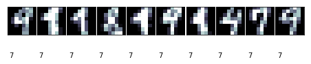


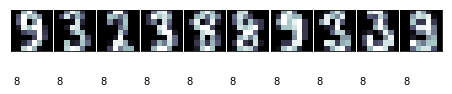


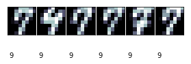


上面的代码显示了每个簇最多10个图像。一些簇是非常清晰的，比如簇编号2对应的图像。

簇编号2对应于0，编号7的效果则并不太好，编号9只有6个样本。

需要明白的是，我们并不是在进行图像的分类（如前一章的人脸识别）。我们是在划分10个分组（可以修改参数调整分组的数量）。

如何评估其性能呢？准确度等方法无法使用，因为我们没有目标值与其进行对比。我们需要知道“实际”的簇，即它的含义。就我们的例子来说，我们可以假定每次绘制都包含了相同的数量。通过这一点，我们可以计算我们的聚类分配和预期值之间的兰德指数（Adjusted Rand Index）。兰德指数类似于精度的概念，但它考虑了这样一个事实，即，类别在不同的聚类分配方式中，可以有不同的名字。如果我们修改了类别名，其索引值不会变。调整后的指数试图从偶然发生的结果巧合中扣除。当两个集合上的簇完全相同时，兰德指数为1，没有簇共享节点时，指数为0。


```python
from sklearn import metrics
print("调整兰德分值：{:.2}".format(metrics.adjusted_rand_score(y_test,y_pred)))

print("混淆矩阵")
print(metrics.confusion_matrix(y_test,y_pred))
```

    调整兰德分值：0.57
    混淆矩阵
    [[ 0  0 43  0  0  0  0  0  0  0]
     [20  0  0  7  0  0  0 10  0  0]
     [ 5  0  0 31  0  0  0  1  1  0]
     [ 1  0  0  1  0  1  4  0 39  0]
     [ 1 50  0  0  0  0  1  2  0  1]
     [ 1  0  0  0  1 41  0  0 16  0]
     [ 0  0  1  0 44  0  0  0  0  0]
     [ 0  0  0  0  0  1 34  1  0  5]
     [21  0  0  0  0  3  1  2 11  0]
     [ 0  0  0  0  0  2  3  3 40  0]]


译注：行是测试标记值，列为预测值。行是0-9。列不是有序的。
观察测试集上的数字0的分类，它被分配在簇编号2（第3列）。对数字8的分类是有问题的：21个实例被分配在编号0上，但有11个分配在编号8。效果并不好。

如果想在图形方式显示k-means聚簇，我们必须将它画在2维平面上。之前已经学习过PCA。我们可以用降维后的数据构建数据点的meshgrid（网格采样点），计算出他们的簇并绘制出来。


```python
from sklearn import decomposition
pca = decomposition.PCA(n_components=2).fit(X_train)
reduced_X_train = pca.transform(X_train)

# 背景网格，用于标识出各个簇的范围
# 网格的步长
h = 0.01
# 网格的范围
x_min,x_max = reduced_X_train[:,0].min()+1,reduced_X_train[:,0].max()-1
y_min,y_max = reduced_X_train[:,1].min()+1,reduced_X_train[:,1].max()-1

# 生成网格采样点
xx,yy = np.meshgrid(np.arange(x_min,x_max,h),np.arange(y_min,y_max,h))
print(xx.shape)

# 训练数据
kmeans = cluster.KMeans(init='k-means++',n_clusters=n_digits,n_init=10)
kmeans.fit(reduced_X_train)
Z = kmeans.predict(np.c_[xx.ravel(),yy.ravel()])
print(Z)
print('----')

Z = Z.reshape(xx.shape)
print(Z)
plt.figure(1)
plt.clf()
# 范围网格数据
plt.imshow(Z,interpolation='nearest',
           extent=(xx.min(),xx.max(),yy.min(),yy.max()),
           cmap=plt.cm.Paired,aspect='auto',origin='lower')

#绘制训练集中的点
plt.plot(reduced_X_train[:,0],reduced_X_train[:,1],'k.',markersize=2)

# 绘制重心为白点
centroids = kmeans.cluster_centers_
plt.scatter(centroids[:,0],centroids[:,1],marker='.',s=169,linewidths=3,color='w',zorder=10)

plt.title('K-means clustering on the digits dataset (PCA reduced data)\n Centroids are marked with white dots')
plt.xlim(x_min,y_max)
plt.ylim(y_min,y_max)
plt.xticks(())
plt.yticks(())
plt.show()
```

    (1514, 1592)
    [8 8 8 ..., 2 2 2]
    ----
    [[8 8 8 ..., 9 9 9]
     [8 8 8 ..., 9 9 9]
     [8 8 8 ..., 9 9 9]
     ..., 
     [1 1 1 ..., 2 2 2]
     [1 1 1 ..., 2 2 2]
     [1 1 1 ..., 2 2 2]]


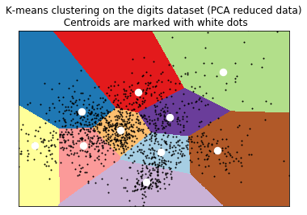


## 其它聚类方法

Sklearn中包含有多个聚类方法，它们的使用方法和参数与k-means类似。本节简要描述这些方法，并给指出它们各自的优点。

多数聚类方法需要指定簇的数量。通常解决这个问题的方法是尝试不同的数量，并使用维度重构的方式将结果可视化，并由专家确定分类的结果是否合适。也有些方法试图自动计算出簇的数量。比如sklearn包含的亲合力传播（Affinity Propagation）算法实现，这个方法从样本中找出最具代表性的部分，并用它们来描述簇。比如：


```python
aff = cluster.AffinityPropagation()
aff.fit(X_train)
print(aff.cluster_centers_indices_.shape)
```

    (112,)


亲合力传播算法从训练集中检测出了112个簇。可以使用前面定义的`print_digits`函数，将各个簇的分组情况打印出来。它的`cluster_centers_indices_`属性包含了算法找到的每个簇对应的元素。

另一个能计算簇数量的是MeanShift。


```python
ms = cluster.MeanShift()
ms.fit(X_train)
print(ms.cluster_centers_.shape)
```

    (18, 64)


它找到了18个簇。`cluster_centers_`属性显示了簇超平面的重心。

注意，上面这两个方法不能使用兰德指数进行评估，因为我们没有一个规范的集合来比较。但是，我们可以测量聚类的惯性，因为惯性是每个数据点到质心距离的总和；我们希望数字接近0。不幸的是，sklearn中除k-means外，其它方法不能测量惯性。

最后，我们将尝试用概率方法进行聚类，从程序的角度来看，它与k-means非常相似，但是它们的理论原理是完全不同的。 GMM假定数据服从具有未知参数的高斯混合分布。 高斯分布是用于对许多现象进行建模的统计学中众所周知的分布函数。它具有以均值为中心的钟形函数;你可能已经看过以下的图：


如果我们足够多的男性身高数据，直方图将服从均值1.774米标准差0.1466米的高斯分布。均值标识出多数可能的值（与曲线的峰值一致），标准差表示结果如何分散；距离平均值多远。如果我们测量两个指定身高间曲线下方的面积（即，它的积分）。如果分布正确，给定一个人，我们可以知道它的身高在给定的两个指定身高之间的概率是多少。我们为什么要期侍这种分布，而不是其它呢？实际上，并不是每个现象都有相同的分布，但是大数定律告诉我们，无论何时我们重复一个实验达到足够多的次数时（例如，测量某人的身高），结果的分布可以近似为高斯发布。

一般来说，我们会是一个多元（即涉及多个特征）分布，但是方法是相同的。超平面上的一个点（均值），大多数样本会更接近它；当我们偏离中间值时，在簇中找到样本的概率将会降低。这个概率下降多少取决于第二个参数，即方差。正如我们所说的，GMM假设每个簇都是一个多元正态分布，方法的目标是找到k个质心（使用称期望最大化（EM）的算法估算训练数据的均值和方差），并将每个点分配到最近的均值。


```python
from sklearn import mixture

gm = mixture.GaussianMixture(n_components=n_digits,
                 covariance_type='tied',random_state=42)
gm.fit(X_train)

```


    GaussianMixture(covariance_type='tied', init_params='kmeans', max_iter=100,
            means_init=None, n_components=10, n_init=1, precisions_init=None,
            random_state=42, reg_covar=1e-06, tol=0.001, verbose=0,
            verbose_interval=10, warm_start=False, weights_init=None)


过程与使用k-means类似。`covariance_type`参数指定我们的期望特征；即，每个像素相关。比如，我们可以假设它们是不相关的，但是我们希望相近的点是相关的。这里，我们使用绑定的协方差类型。


```python
y_pred = gm.predict(X_test)
print("Adjusted rand score:{:.2}".format(metrics.adjusted_rand_score(y_test,y_pred)))

print("Homogeneity score:{:.2}".format(metrics.homogeneity_score(y_test,y_pred)))

print("Completeness score:{:.2}".format(metrics.completeness_score(y_test,y_pred)))
```

    Adjusted rand score:0.46


与k-means相比，得到了更好的兰德分值（译注：我这里是更差了）。上面也包含了sklearn.metrics中两个新的评价方法。同质性（Homogeneity）是一个0.0和1.0间的数值（越大越好）。数值1.0表示簇的数据点都是属于单一分类的，表明聚类效果非常好。完整性（Completeness）是当给定分类的所有点都在同样的簇中（对所有样本进行了有效的分类，而不是构建出多个小而独立的簇）。我们可以把同质性和完整性当作非监督学习中的精度和召回率（recall）。

