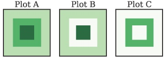

# NumPy

## NumPy 数组

    `ndarray`与list类似，但是它只允许存储一种类型的数据。这样能得更好的弹性。


```python
import numpy as np
```


```python
arr = np.arange(1e7) # 10^7 element
larr = arr.tolist()

def list_times(alist, scalar):
    for i,val in enumerate(alist):
        alist[i] = val * scalar
    return alist
```


```python
# 使用numpy进行计算
%timeit arr * 1.1
```

    10 loops, best of 3: 29.9 ms per loop


```python
# 纯python计算
%timeit list_times(larr,1.1)
```

    1 loops, best of 3: 947 ms per loop


使用`matrix`进行线性代数操作，与ndarray不同的是matrix对象只能是二维的。


```python
# 创建3D numpy数组
arr = np.zeroes(3,3,3)

# 将ndarray转为matrix
mat = np.matrix(arr)

```


    ---------------------------------------------------------------------------

    AttributeError                            Traceback (most recent call last)

    <ipython-input-8-704c01cd77cc> in <module>()
          1 # 创建3D numpy数组
    ----> 2 arr = np.zeroes(3,3,3)
          3 
          4 # 将ndarray转为matrix
          5 mat = np.matrix(arr)


    AttributeError: 'module' object has no attribute 'zeroes'


### 数组的创建和数据类型


```python
alist = [1,2,3]
arr = np.array(alist)

#初值为0的数组
arr = np.zeros(5)

#0-100
arr = np.arange(100)

#10-100
arr = np.arange(10,100)

#0至1之间的100个
arr = np.linspace(0,1,100)

#10为底的对数
arr = np.logspace(0,1,100,base = 10.0)

#5x5的数组
image = np.zeros((5,5))

# 5x5x5的立方体，初始为0，转为整型，再+1
cube = np.zeros((5,5,5)).astype(int) + 1

# 16bit浮点数
cube = np.ones((5,5,5)).astype(np.float16)

# 2个元素值都为0，类型为int
arr = np.zeros(2,dtype=int)

# 2个元素值为0，类型为float32
arr = np.zeros(2,dtype=np.float32)

# 数组元素为0至999
arr1d = np.arange(1000)

# 将arr1d转为10x10x10的3维数组
arr3d = arr1d.reshape((10,10,10))

# 另一种转换方式
arr3d = np.reshape(arr1d,(10,10,10))

# 将多维数组，平坦化（flatten）
arr4d = np.zeros((10,10,10,10))

arr1d = arr4d.ravel()
np.shape(arr1d)
arr1d.shape
```


    (10000,)


`注意`:上面对数组结构的修改只是提供了对同一份内存数据的不同视图。修改任何一个数组，都会影响所有数组。如果希望单独修改每一个数组，则应该使用'`numpy.copy`对数组进行复制。

### 记录数组（`recarray`元素为结构化数据）


```python
# 创建数组，并定义列类型，分别为32bit int，32bit float和10字符长度的字符串
recarr = np.zeros((2,),dtype=('i4,f4,a10'))
print(recarr)
toadd = [(1,2.,'Hello'),(2,3.,"World")]
recarr[:] = toadd
print(recarr)
```

    [(0, 0.0, '') (0, 0.0, '')]
    [(1, 2.0, 'Hello') (2, 3.0, 'World')]


```python
#使用python自带的zip方法来生成数组的行
col1 = np.arange(2)+1
col2 = np.arange(2,dtype=np.float32)
col3 = ['Hello','World']

toadd = zip(col1,col2,col3)

#赋值
recarr[:] = toadd
print(toadd)
```

    [(1, 0.0, 'Hello'), (2, 1.0, 'World')]


```python
#给每列定义名字
recarr.dtype.names = ('Integers','Floats','String')
#通过名字取一列
recarr['Integers']
```


    array([1, 2], dtype=int32)


### 索引和切片
python中的list可以通过索引取得元素，但是无法不遍历而获取整列。在NumPy中，索引则更为灵活。


```python
# python数组
alist = [[1,2],[3,4]]
#取(0,1)位置的元素 
arr = np.array(alist)
#取(0,1)位置的元素
print(arr[0,1])

#取右边的列
print(arr[:,1])

#取下面的行
print(arr[1,:])
```

    2
    2
    [2 4]
    [3 4]


复杂的条件索引可以使用`numpy.where()`。使用这个函数可以基于条件返回需要的数据，而不通过索引。


```python
arr = np.arange(5)+1

# 所有大于2的元素的索引
index = np.where(arr>2)
print(index)

new_arr = arr[index]
print(new_arr)
```

    (array([2, 3, 4]),)
    [3 4 5]


```python
#删除元素
new_arr = np.delete(arr,index)

print(new_arr)

#使用布尔值代替where进行过滤
index = arr > 2
print(index)
new_arr = arr[index]
print(new_arr)
```

    [1 2]
    [False False  True  True  True]
    [3 4 5]


在元素数量较大时，使用布尔值过滤通常会更快。还可以使用`~`对数组中的布尔值取反，它的速度会比重新执行`numpy.where`函数更快。

## 布尔语句和NumPy数组

布尔语句通常与`and`和`or`操作符组合使用，用于布尔值比较。但是在NumPy数组中，你可以只能使用`&`和`|`，这使得能快速的比较布尔值。

下例使用数组模拟图像:



```python
#创建图像
img1 = np.zeros((20,20)) + 3
#第4行至倒数4行，第4列至倒数4列设置为6
img1[4:-4,4:-4] = 6
#第7行至倒数7行，第7列至倒数7列设置为9
img1[7:-7,7:-7] = 9
#生成图像A

#过滤所有大于2小于6的元素设置为0
index1 = img1 > 2
index2 = img1 < 6
#and组合
compound_index = index1 & index2
#也可以写作compound_index (img1 > 3) & (img1 < 7)的形式
img2 = np.copy(img1)
img2[compound_index]=0
#生成图像B

#不为9或大于2小于6的元素设置为0(只保留了为6的环状)
index3 = img1 == 9
index4 = (index1 & index2) | index3
img3 = np.copy(img1)
img3[index4] = 0
#生成图像C
```

`注意`：在构建组合布尔参数时，需要使用括号。


```python
import numpy.random as rand
#创建100个元素的随机数组
a = rand.randn(100)

index = a > 0.2
b = a[index]

b = b ** 2 - 2

#修改原始的数组a
a[index] = b
```

## 文件读写

### 文本文件

通过NumPy提供的`loadtxt`方法可以直接将数据加载为`numpy.ndarray`格式。如果数据是按行和列的形式组织的，loadtxt将会使用合适的数据类型加载数据。可以使用`numpy.savetxt`来快速生成`numpy.readtxt`。


```python
a = rand.rand(9)
a=a.reshape(3,3)
np.savetxt('chap02.txt',a)
b = np.loadtxt('chap02.txt')
print(b)
%cat chap02.txt
```

    [[ 0.77167676  0.92569314  0.85121034]
     [ 0.57092315  0.54171279  0.28679945]
     [ 0.87396743  0.95719303  0.31715228]]
    7.716767609951945550e-01 9.256931439674558337e-01 8.512103364017590268e-01
    5.709231475688880675e-01 5.417127876887067872e-01 2.867994483215262624e-01
    8.739674341488654630e-01 9.571930323898591997e-01 3.171522785297289371e-01


如果每列的格式不同，仍然可以通过指定列类型来加载数据。最终加载的数据是`recarray`。


```python
#加载格式化数据
table = np.loadtxt('chap02-example.txt',
                  dtype={'names':('ID','Result','Type'),
                         'formats':('S4','f4','i2')})
table['ID']
```


    array(['XR21', 'XR22'], 
          dtype='|S4')


至NumPy1.8，numpy都没有将`recarry`数据保存为文本的方法。如果需要保存recarry结构数据，可以使用`matplotlib.mlab`。

### 二进制文件

二进制文件在文件大小和读写速度上都有优势。

在`NumPy`中可以使用`numpy.save`和`numpy.load`访问二进制数据。主要限制在于只能使用NumPy进行读取。如果对数据的移植性有要求，应该使用`scipy.io`。


```python
data = np.empty((1000,1000))
np.save('chap02.npy',data)

#使用savez会对数据进行压缩，生成的文件会更小
np.savez('chap02.npz',data)

#加载数据
newdata = np.load('chap02.npy')
newdata.shape
```


    (1000, 1000)


与文本文件不能直接保存recarray数据不同。numpy.save和numpy.savez都可以处理numpy.recarray对象。

## 数学计算

Python自带的`math`模块无法处理NumPy数组。NumPy数组自带了数学计算工具。这些工具是专门针对NumPy数组对象进行了优化的。


### 线性代数

默认情况下NumPy的数组与线性代数中的矩阵并不相同。数学操作将被应用到数组的每个元素上。如果要进行转置和点乘，则可以使用`numpy.transpose`和`numpy.dot`。如果使用`numpy.matrix`类型的对象，则可以使用纯粹的矩阵运算。

示例矩阵：
$$ 
\begin{align} \\
3x + 6y - 5z = 12 \\
x - 3y + 2z = -2 \\
5x -y + 4z = 10 \\
\end{align} 
$$

$$
\begin{bmatrix}
3 & 6 & -5 \\
1 & -3 & 2 \\
5 & -1 & 4 \\
\end{bmatrix} 
\begin{bmatrix}
x \\
y \\
z \\
\end{bmatrix} = 
\begin{bmatrix}
12 \\
-2 \\
10 \\
\end{bmatrix}
$$

下面使用矩阵来表达 $ AX = B $，解该矩阵方程，即：$ X = A^{-1}B $


```python
A = np.matrix([[3,6,-5],
              [1,-3,2],
              [5,-1,4]])
B = np.matrix([[12],
              [-2],
              [10]])

#通过A的逆求出X，这里没有检查A的行列式是否为0
#可以使用numpy.linalg.svd进行检查
%timeit X = A ** (-1) * B
X
```

    The slowest run took 4.52 times longer than the fastest. This could mean that an intermediate result is being cached 
    10000 loops, best of 3: 28.8 µs per loop


    matrix([[ 1.75],
            [ 1.75],
            [ 0.75]])


下面不使用numpy.matrix来解该方程。


```python
a = np.array([[3,6,-5],
              [1,-3,2],
              [5,-1,4]])
b = np.array([[12],
              [-2],
              [10]])

#通过A的逆来计算x
%timeit x = np.linalg.inv(a).dot(b)
x
```

    The slowest run took 5.85 times longer than the fastest. This could mean that an intermediate result is being cached 
    100000 loops, best of 3: 11 µs per loop


    array([[ 1.75],
           [ 1.75],
           [ 0.75]])


上面两种方法都可以进行线性代数计算，虽然使用numpy.matrix更直观，但是实际应用中使用numpy.array更多一些。NumPy的数组广泛的被使用在Python的各种科学计算环境中，bug比numpy.matrix要更少一些，另外，使用numpy.array的方法计算速度会更快一点。

如果将numpy.matrix当作numpy.array传递给函数时可能会产生麻烦，所以应该尽量使用numpy.array。
